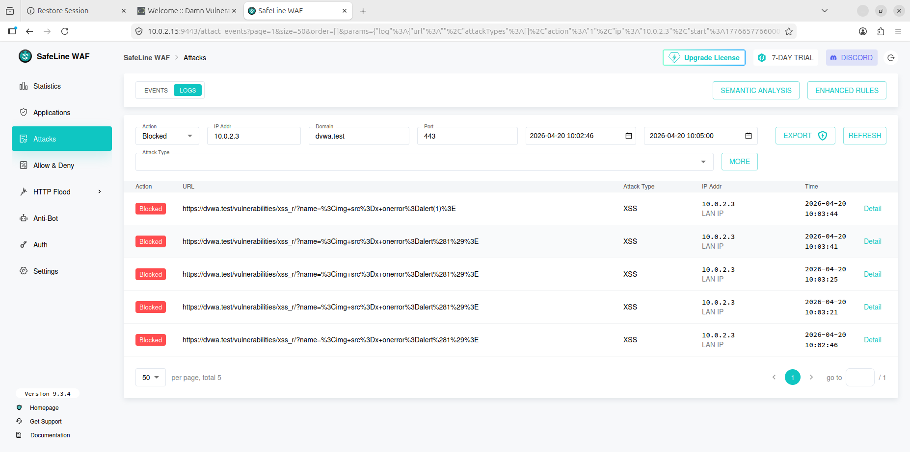
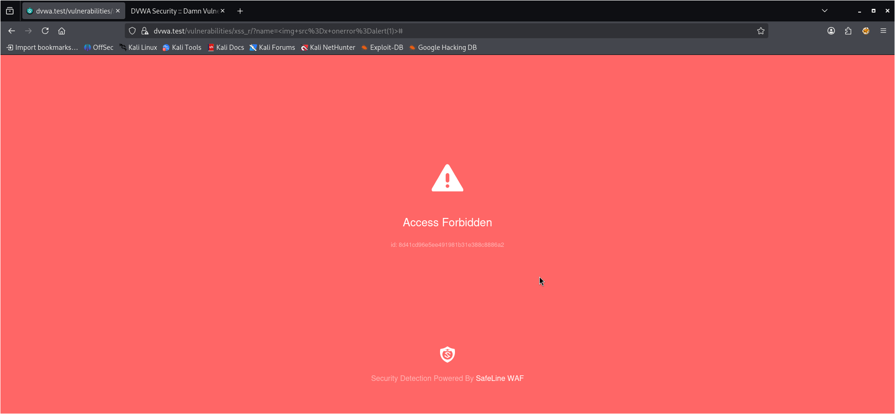

# Implementation of a WAF(SafeLine) & protect web application (DVWA)

## 📌 Project Overview

This project demonstrates the implementation of a Web Application Firewall (SafeLine) to protect a vulnerable web application (DVWA). By positioning the WAF as a reverse proxy, I successfully mitigated several OWASP Top 10 vulnerabilities including SQL Injection, XSS, and Command Injection, while also implementing Rate Limiting to prevent HTTP Flooding.

## 🏗️ Architecture
The lab environment was built using a NAT Network in VirtualBox to simulate a real-world enterprise DMZ:
- Attacker: Kali Linux (Attacking via curl, ab, and Firefox).
- WAF (Reverse Proxy): SafeLine WAF running on Ubuntu Server.
- Victim App: Damn Vulnerable Web App (DVWA) hosted on the same Ubuntu server via Docker (Port 8080).

## ⚙️ Configuration & Setup
### 1. Networking (DNS Simulation)
To simulate production DNS, I configured the /etc/hosts file on the Kali machine to map the WAF's IP to the project domain:

```10.0.2.15   dvwa.test```
### 2. WAF Protection Settings
I configured Attack Limiting to ensure automated mitigation of malicious actors:
- Duration: 60 Seconds
- Attack Threshold: 3
- Action: Block (IP Banned for 30 minutes)
- SSL: Generated and applied a self-signed certificate for ```https://dvwa.test```.

## ⚔️ Security Testing & Evidence
### Test 1: SQL Injection (SQLi)
- Payload: ```' OR 1=1 #```
- 
- 
- Result : Blocked. SafeLine's Semantic Analysis engine identified the logical anomaly and dropped the packet.
### Test 2: Cross-Site Scripting (XSS)
- Payload: ```<script>alert('Hacked')</script>```
- 
- 
- Result: Blocked. The WAF intercepted the script tags and prevented the browser from executing the malicious code.
### Test 4: HTTP Flood (DoS Mitigation)
- Attack Command: ab -n 500 -c 10 http://dvwa.test/
- Result: SafeLine identified the high-frequency request pattern and triggered a CAPTCHA Challenge, protecting the backend CPU from exhaustion.

## 📊 Collected Evidence
Note: Screenshots of the following are located in the /mages folder of this repo.
- Intercepted Page: The 403 Forbidden screen shown to the Kali attacker.
- Dashboard Logs: Real-time event logs showing the "SQL Injection" classification.
- Semantic Analysis Details: Detailed view of the WAF parsing the attack payload.

## 🧠 Key Learnings
- Reverse Proxy Logic: Configuring 000-default.conf and netplan to ensure proper traffic routing.
- WAF vs. Regex: Understanding how SafeLine uses intelligent parsing instead of simple word-matching to stop obfuscated attacks.
- SSL Termination: Deploying HTTPS at the edge (WAF) to inspect encrypted traffic before it reaches the web server.
